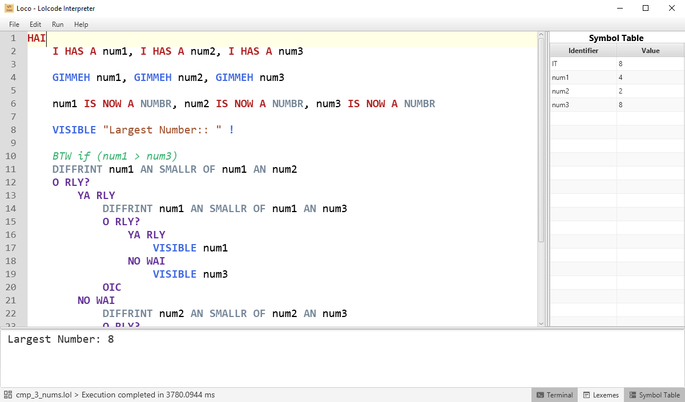

# **Loco**

Loco is an interpreter for the [Lolcode][1] programming language. Syntax for the programming language can be found [here][2].

Loco features a lexical analyzer, syntax analyzer, and semantic analyzer coded in the Java programming language. The GUI was made by utilizing [JavaFX][3] and [SceneBuilder][4].

Loco aims to able to correctly parse and execute `.lol` files according to specifications. Some sample Lolcode files are included [in the repo](Samples/).

## Usage
---
### Run Hotkeys
* F6: Run program
* F7: Start Debugger
* F8: Run Next Line (only allowed if Debugger is active)

## Features
---
* Syntax Highlighting in the code editor
* Lexeme list which identifies the TokenType of each lexeme
* Symbol Table which displays the current values of variables
* Adjustable code editor font size
* Viewable parse tree
* Line by line debugger

## Building
---
Prerequisites are [Java][5] and [Maven][6].
1. Get the source by cloning the repo:
   
   `git clone https://github.com/jpcarreon/loco.git`
2. `cd` into the root folder and switch to the `maven-build` branch with:

    `git checkout maven-build`
3. `cd` into the project folder `Loco`. Make sure you are in the folder with the `pom.xml` file.
4. Use Maven to build and run using the following command:

    `mvn clean javafx:run`
5. (Optional) `.jar` file can be generated by the following command:

    `mvn clean package`

    The `.jar` file will be located inside the `target` folder

##  Credits
---
* [RichTextFx][7] for the code editor
* [Flowless][8] for scrollbars in the code editor

[1]: http://www.lolcode.org/
[2]: https://github.com/justinmeza/lolcode-spec/blob/master/v1.2/lolcode-spec-v1.2.md
[3]: https://openjfx.io/
[4]: https://gluonhq.com/products/scene-builder/
[5]: https://www.oracle.com/java/technologies/downloads/
[6]: https://maven.apache.org/
[7]: https://github.com/FXMisc/RichTextFX
[8]: https://github.com/FXMisc/Flowless