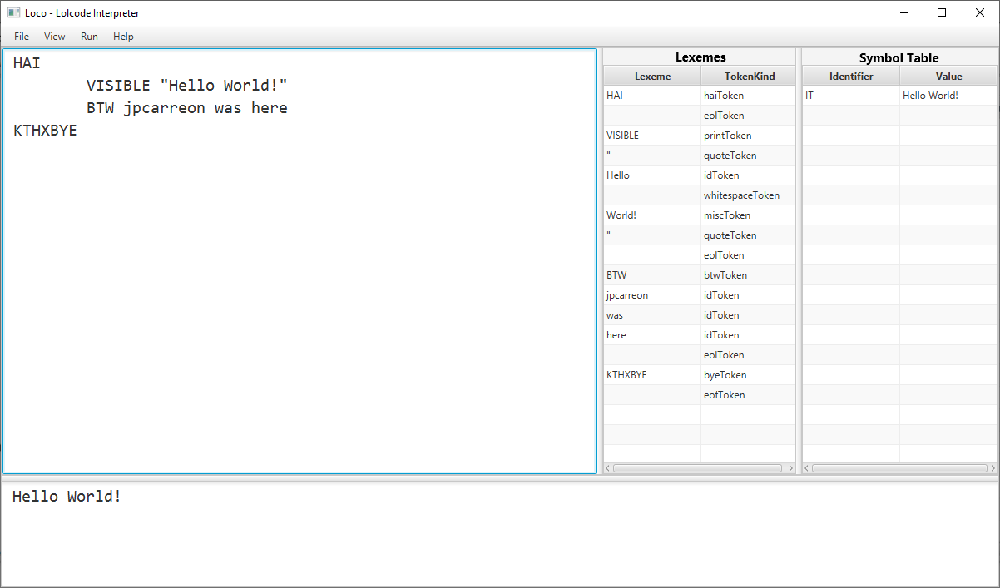
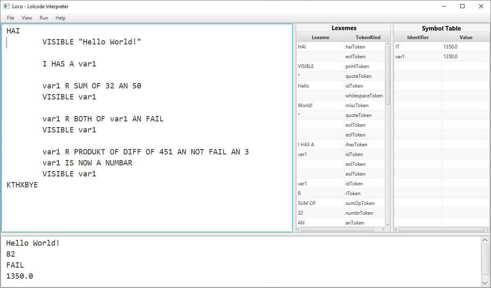
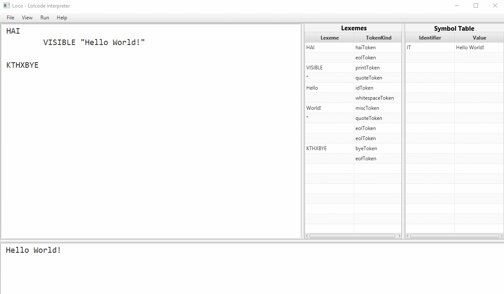
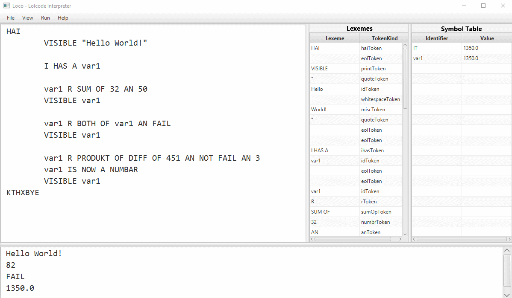
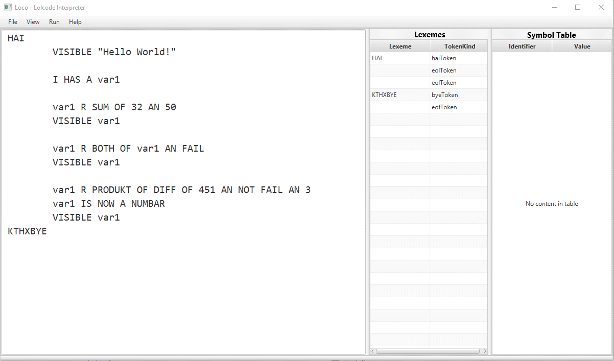

# Loco - Lolcode Interpreter

Loco is an interpreter for the [Lolcode][1] programming language. Syntax for the programming language can be found [here][2].

This project features a lexical analyzer (lexer), syntax analyzer (parser), and semantic analyzer coded in the Java programming language. The GUI wss made by utilizing [JavaFX][3] and [SceneBuilder][4].

Loco aims to able to correctly execute `.lol` files. Most of Lolcode syntax has already been implemented. 

I also decided to include some fun little features in the GUI. Such as:

Adjustable Panels

Viewable Parse Tree

Line by Line Debugger

... and more minor features.

[1]: http://www.lolcode.org/
[2]: https://github.com/justinmeza/lolcode-spec/blob/master/v1.2/lolcode-spec-v1.2.md
[3]: https://openjfx.io/
[4]: https://gluonhq.com/products/scene-builder/